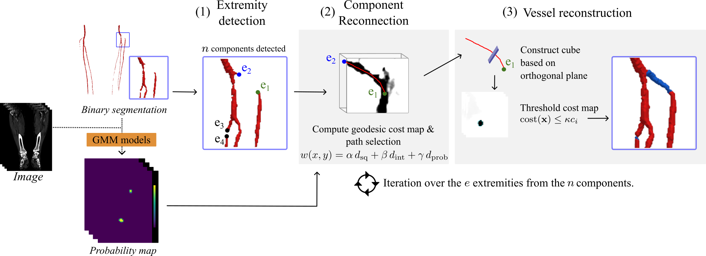

# Geodesic Vessels

This repository contains tools for analyzing and reconstructing vascular
structures using geodesic distances computed on medical images.  The code
is primarily written in Python and relies on NumPy, PyTorch, SciPy,
scikit-learn and visualization libraries (Plotly, PyVista).



## Package Structure

- **src/geodesic_vessels/**
  - `utils.py` – miscellaneous helpers including image comparison,
    3D rendering functions and Gaussian mixture models for lumen
    probability estimation.
  - `extremities.py` – routines for extracting component extremities
    (endpoints) from a labeled mask; supports skeletonization, graph
    conversion, tangent and radius estimation.
  - `paths.py` – core geodesic distance computation using a GPU- accelerated
    Jacobi solver; backtracking, path validity and multi-component path
    management classes are included.
  - `reconstructions.py` – methods to rebuild tubular vessels from
    centerline paths using radius or geodesic-based heuristics.
  - `metrics.py` – evaluation metrics helpers.
  - `hyperparameters.py` – configuration helpers.
  - `main.py` – entry points for command-line usage.
  - `__init__.py` – package initializer.

## Key Concepts

1. **Extremity Extraction**
   - Use `Extremities3D` to derive skeletons of labeled components and
     identify endpoint coordinates with associated tangent directions and
     radii.

2. **Geodesic Path Computation**
   - Every extremity is processed by `GeodesicPath3D` to compute a
     3D geodesic cost map via a Jacobi iteration (`geodesic_distance_torch_3d`).
   - Backtracking finds minimal-energy paths through the cost map.
   - `GeodesicPaths3D` orchestrates path computation for all extremities,
     filtering duplicates and exporting merged cost maps.

3. **Reconstruction**
   - The `ReconstructVessel3D` class can rebuild a vessel mask from a
     centerline path using several strategies (`radius`, `geodesic`,
     `scale`, `centerline`).  `ReconstructVessels3D` handles multiple
     paths.

4. **Utilities**
   - Visualization of segmentation results (3D) and rendering of
     surfaces using PyVista.
   - GMM-based probability estimation for lumen segmentation.
   - Calibration of probabilistic maps.

## Installation

Clone the repository and install the package.
   ```bash
   git clone <repo-url> geodesic-vessels
   cd geodesic-vessels
   pip install .
   ```

Complementary packages can be required:
```bash
   pip install pynrrd matplotlib 
   ```


## Basic Usage Examples

Check python script `example.py`.

